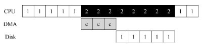

## 标准协议

在图36.2 中，一个（简化的）设备接口包含3 个寄存器：一个状态（status）寄存器，
可以读取并查看设备的当前状态；一个命令（command）寄存器，用于通知设备执行某个具
体任务；一个数据（data）寄存器，将数据传给设备或从设备接收数据。通过读写这些寄存
器，操作系统可以控制设备的行为。

##  利用中断减少 CPU 开销

如果我们利用中断并允许重叠，操作系统就可以在等待磁盘操作时做其他事情：

注意，使用中断并非总是最佳方案。假如有一个非常高性能的设备，它处理请求很快：通常在CPU 第一次轮询时就可以返回结果。此时如果使用中断，反而会使系统变慢：切换到其他进程，处理中断，再切换回之前的进程代价不小。因此，如果设备非常快，那么最好的办法反而是轮询。如果设备比较慢，那么采用允许发生重叠的中断更好。如果设备的速度未知，或者时快时慢，可以考虑使用混合（hybrid）策略，先尝试轮询一小段时间，如果设备没有完成操作，此时再使用中断。

另一个最好不要使用中断的场景是网络。网络端收到大量数据包，如果每一个包都发生一次中断，那么有可能导致操作系统发生活锁（livelock），即不断处理中断而无法处理用户层的请求。

另一个基于中断的优化就是合并（coalescing）。设备在抛出中断之前往往会等待一小段时间，在此期间，其他请求可能很快完成，因此多次中断可以合并为一次中断抛出，从而降低处理中断的代价。

## 利用DMA进行更高效的数据传送

标准协议还有一点需要我们注意。具体来说，如果使用编程的I/O 将一大块数据传给设备，CPU 又会因为琐碎的任务而变得负载很重，浪费了时间和算力，本来更好是用于运行其他进程。

解决方案就是使用DMA（Direct Memory Access）。DMA 引擎是系统中的一个特殊设备，
它可以协调完成内存和设备间的数据传递，不需要CPU 介入。 

## 设备交互的方法

随着技术的不断发展，主要有两种方式来实现与设备的交互。第一种办法相对老一些（在 IBM 主机中使用了多年），就是用明确的 I/O 指令。

第二种方法是内存映射I/O（memory- mapped I/O）。通过这种方式，硬件将设备寄存器作为内存地址提供。当需要访问设备寄存器时，操作系统装载（读取）或者存入（写入）到该内存地址；然后硬件会将装载/存入转移到设备上，而不是物理内存。

## 纳入操作系统：设备驱动程序
这个问题可以通过古老的抽象（abstraction）技术来解决。在最底层，操作系统的一部分软件清楚地知道设备如何工作，我们将这部分软件称为设备驱动程序（device driver），所有设备交互的细节都封装在其中。