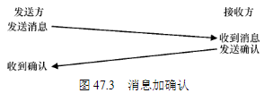
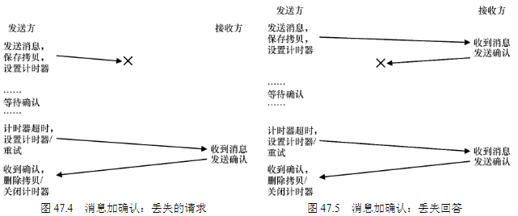

##   通信基础
现代网络的核心原则是，通信基本是不可靠的。无论是在广域Internet，还是 Infiniband等局域高速网络中，数据包都会经常丢失、损坏，或无法到达目的地。

##  不可靠的通信层

一个简单的方法是：我们不处理它。由于某些应用程序知道如何处理数据包丢失，因此让它们用基本的不可靠消息传递层进行通信有时很有用，这是端到端的论点（end-to-end argument）的一个例子，人们经常听到（参见本章结尾处的补充）。

UDP 是不可靠通信层的一个很好的例子。如果你使用它，就会遇到数据包丢失（丢弃），从而无法到达目的地的情况。发送方永远不会被告知丢失。但是，这并不意味着UDP 根本不能防止任何故障。例如，UDP 包含校验和（checksum），以检测某些形式的数据包损坏。

## 可靠的通信层

考虑一个简单的示例，其中客户端通过不可靠的连接向服务器发送消息。我们必须回答的第一个问题是：发送方如何知道接收方实际收到了消息？我们要使用的技术称为确认（acknowledgment），或简称为ack。这个想法很简单：发送方向接收方发送消息，接收方然后发回短消息确认收到。

但是，如果没有收到确认，发送方应该怎么办？为了处理这种情况，我们需要一种额外的机制，称为超时（timeout）。当发送方发送消息时，发送方现在将计时器设置为在一段时间后关闭。如果在此时间内未收到确认，则发送方断定该消息已丢失。发送方然后就重试（retry）发送，再次发送相同的消息，希望这次
它能送达。要让这种方法起作用，发送方必须保留一份消息副本，以防它需要再次发送。超时和重试的组合导致一些人称这种方法为超时/重试（timeout/retry）。

遗憾的是，这种形式的超时/重试还不够。图47.5 展示了可能导致故障的数据包丢失示例。在这个例子中，丢失的不是原始消息，而是确认消息。从发送方的角度来看，情况似乎是相同的：没有收到确认，因此超时和重试是合适的。但是从接收方的角度来看，完全不同：现在相同的消息收到了两次！虽然可能存在这种情况，但通常情况并非如此。设想下载文件时，在下载过程中重复多个数据包，会发生什么。因此，如果目标是可靠的消息层，我们通常还希望保证接收方每个消息只接收一次（exactly once）。

为了让接收方能够检测重复的消息传输，发送方必须以某种独特的方式标识每个消息，并且接收方需要某种方式来追踪它是否已经看过每个消息。当接收方看到重复传输时，它只是简单地响应消息，但（严格地说）不会将消息传递给接收数据的应用程序。因此，发送方收到确认，但消息未被接收两次，保证了上面提到的一次性语义。 

有许多方法可以检测重复的消息。例如，发送方可以为每条消息生成唯一的 ID。接收
方可以追踪它所见过的每个 ID。这种方法可行，但它的成本非常高，需要无限的内存来跟
踪所有ID。 

一种更简单的方法，只需要很少的内存，解决了这个问题，该机制被称为顺序计数器（sequence counter）。利用顺序计数器，发送方和接收方就每一方将维护的计数器的起始值达成一致（例如1）。无论何时发送消息，计数器的当前值都与消息一起发送。此计数器值（N）作为消息的ID。发送消息后，发送方递增该值（到N + 1）并等待下一条消息。 

如果确认丢失，则发送方将超时，并重新发送消息N。这次，接收器的计数器更高（N+1），因此接收器知道它已经接收到该消息。因此它会确认该消息，但不会将其传递给应用程序。以这种简单的方式，顺序计数器可以避免重复。

## 通信抽象

大多数DSM 系统的工作方式是通过操作系统的虚拟内存系统。在一台计算机上访问页面时，可能会发生两种情况。在第一种（最佳）情况下，页面已经是机器上的本地页面，因此可以快速获取数据。在第二种情况下，页面目前在其他机器上。发生页面错误，页面错误处理程序将消息发送到其他计算机以获取页面，将其装入请求进程的页表中，然后继续执行。由于许多原因，这种方法今天并未广泛使用。DSM 最大的问题是它如何处理故障。另一个问题是性能。人们通常认为，在编写代码时，访问内存的成本很低。在DSM 系
统中，一些访问是便宜的，但是其他访问导致页面错误和远程机器的昂贵提取。因此，这
种DSM 系统的程序员必须非常小心地组织计算，以便几乎不发生任何通信，从而打败了这
种方法的主要出发点。

## 远程过程调用（RPC）

远程过程调用包都有一个简单的目标：使在远程机器上执行代码的过程像调用本地函数一样简单直接。因此，对于客户端来说，进行一个过程调用，并在一段时间后返回结果。服务器只是定义了一些它希望导出的例程。其余的由RPC 系统处理，RPC 系统通常有两部分：存根生成器（stub generator，有时称为协议编译器，protocol compiler）和运行时库（run-time library）。

### 存根生成器
存根生成器的工作很简单：通过自动化，消除将函数参数和结果打包成消息的一些痛苦。这有许多好处：通过设计避免了手工编写此类代码时出现的简单错误。此外，存根生成器也许可以优化此类代码，从而提高性能。

### 运行时库

我们必须克服的首要挑战之一，是如何找到远程服务。最简单的方法建立在现有命名系统上，例如，当前互联网协议提供的主机名和端口号。在这样的系统中，客户端必须知道运行所需RPC 服务的机器的主机名或IP 地址，以及它正在使用的端口号（端口号就是在机器上标识发生的特定通信活动的一种方式，允许同时使用多个通信通道）。然后，协议套件必须提供一种机制，将数据包从系统中的任何其他机器路由到特定地址。

一旦客户端知道它应该与哪个服务器通信，以获得特定的远程服务，下一个问题是应该构建 RPC 的传输级协议。具体来说，RPC 系统应该使用可靠的协议（如TCP/IP），还是建立在不可靠的通信层（如UDP/IP）上？