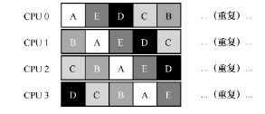
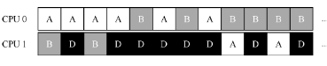

# 多处理器调度

当然，多核CPU 带来了许多困难。主要困难是典型的应用程序（例如你写的很多C程序）都只使用一个CPU，增加了更多的CPU 并没有让这类程序运行得更快。为了解决这个问题，不得不重写这些应用程序，使之能并行（parallel）执行，也许使用多线程（thread，本书的第2 部分将用较多篇幅讨论）。

## 背景：多处理器架构

了理解多处理器调度带来的新问题，必须先知道它与单CPU 之间的基本区别。区别
的核心在于对硬件缓存（cache）的使用（见图10.1），以及多处理器之间共享数据的方式。

在单CPU 系统中，存在多级的硬件缓存（hardware  cache），一般来说会让处理器更快地执行程序。

缓存是基于局部性（locality）的概念，局部性有两种，即时间局部性和空间局部性。时间局部性是指当一个数据被访问后，它很有可能会在不久的将来被再次访问，比如循环代码中的数据或指令本身。而空间局部性指的是，当程序访问地址为 x的数据时，很有可能会紧接着访问 x周围的数据，比如遍历数组或指令的顺序执行。

事实证明，多CPU 的情况下缓存要复杂得多。

这一普遍的问题称为缓存一致性（cache coherence）问题

硬件提供了这个问题的基本解决方案：通过监控内存访问，硬件可以保证获得正确的数据，并保证共享内存的唯一性。在基于总线的系统中，一种方式是使用总线窥探（bus  snooping）[G83]。每个缓存都通过监听链接所有缓存和内存的总线，来发现内存访问。如果CPU 发现对它放在缓存中的数据的更新，会作废（invalidate）本地副本（从缓存中移除），或更新（update）它（修改为新值）。回写缓存，如上面提到的，让事情更复杂（由于对内
存的写入稍后才会看到），你可以想想基本方案如何工作。

## 别忘了同步

跨CPU 访问（尤其是写入）共享数据或数据结构时，需要使用互斥原语（比如锁），才能保证正确性（其他方法，如使用无锁（lock-free）数据结构，很复杂，偶尔才使用。

然而，让这类函数正确工作的方法是加锁（locking）。这里只需要一个互斥锁（即pthread_mutex_t m;），然后在函数开始时调用lock(&m)，在结束时调用unlock(&m)，确保代码的执行如预期。我们会看到，这里依然有问题，尤其是性能方面。具体来说，随着 CPU
数量的增加，访问同步共享的数据结构会变得很慢。 

## 缓存亲和度

在设计多处理器调度时遇到的最后一个问题，是所谓的缓存亲和度（cache affinity）。这
个概念很简单：一个进程在某个CPU 上运行时，会在该CPU 的缓存中维护许多状态。下次
该进程在相同CPU 上运行时，由于缓存中的数据而执行得更快。相反，在不同的CPU 上执
行，会由于需要重新加载数据而很慢（好在硬件保证的缓存一致性可以保证正确执行）。因
此多处理器调度应该考虑到这种缓存亲和性，并尽可能将进程保持在同一个CPU 上。

## 单队列调度

基本的方式是简单地复用单处理器调度的基本架构，将所有需要调度的工作放入一个单独的队列
中，我们称之为单队列多处理器调度（Single Queue Multiprocessor Scheduling，SQMS）。这个方法最大的优点是简单。它不需要太多修改，就可以将原有的策略用于多个 CPU，选择最适合的工作来运行（例如，如果有两个CPU，它可能选择两个最合适的工作）。

然而，SQMS 有几个明显的短板。第一个是缺乏可扩展性（scalability）。为了保证在多
CPU 上正常运行，调度程序的开发者需要在代码中通过加锁（locking）来保证原子性。然而，锁可能带来巨大的性能损失，尤其是随着系统中的CPU 数增加时[A91]。随着这种单个锁的争用增加，系统花费了越来越多的时间在锁的开销上，较少的时间用于系统应该完成的工作

SQMS 的第二个主要问题是缓存亲和性。

一段时间后，假设每个工作依次执行一个时间片，然后选择另一个工作，下面是每个CPU 可能的调度序列：

由于每个CPU 都简单地从全局共享的队列中选取下一个工作执行，因此每个工作都不断在不同CPU 之间转移，这与缓存亲和的目标背道而驰。

为了解决这个问题，大多数 SQMS 调度程序都引入了一些亲和度机制，尽可能让进程在同一个CPU 上运行。保持一些工作的亲和度的同时，可能需要牺牲其他工作的亲和度来实现负载均衡。例如，针对同样的5 个工作的调度如下：

## 多队列调度

正是由于单队列调度程序的这些问题，有些系统使用了多队列的方案，比如每个 CPU一个队列。我们称之为多队列多处理器调度（Multi-Queue Multiprocessor Scheduling，MQMS）

在MQMS 中，基本调度框架包含多个调度队列，每个队列可以使用不同的调度规则，比如轮转或其他任何可能的算法。当一个工作进入系统后，系统会依照一些启发性规则（如随机或选择较空的队列）将其放入某个调度队列。这样一来，每个CPU 调度之间相互独立，就避免了单队列的方式中由于数据共享及同步带来的问题。

MQMS 比SQMS 有明显的优势，它天生更具有可扩展性。队列的数量会随着CPU 的增加而增加，因此锁和缓存争用的开销不是大问题。此外，MQMS 天生具有良好的缓存亲和度。所有工作都保持在固定的CPU 上，因而可以很好地利用缓存数据。

但是，如果稍加注意，你可能会发现有一个新问题（这在多队列的方法中是根本的），即负载不均（load imbalance）。

最明显的答案是让工作移动，这种技术我们称为迁移（migration）。通过工作的跨CPU迁移，可以真正实现负载均衡

更棘手的情况是较早一些的例子，A 独自留在CPU 0 上，B 和D 在CPU 1 上交替运行。

在这种情况下，单次迁移并不能解决问题。应该怎么做呢？答案是不断地迁移一个或多个工作。一种可能的解决方案是不断切换工作，如下面的时间线所示。可以看到，开始的时候A 独享CPU 0，B 和D 在CPU 1。一些时间片后，B 迁移到CPU 0 与A 竞争，D 则独享CPU 1 一段时间。这样就实现了负载均衡。

但现在是最棘手的部分：系统如何决定发起这样的迁移？ 

一个基本的方法是采用一种技术，名为工作窃取（work stealing）[FLR98]。通过这种方法，工作量较少的（源）队列不定期地“偷看”其他（目标）队列是不是比自己的工作多。
如果目标队列比源队列（显著地）更满，就从目标队列“窃取”一个或多个工作，实现负载均衡。 

当然，这种方法也有让人抓狂的地方——如果太频繁地检查其他队列，就会带来较高的开销，可扩展性不好，而这是多队列调度最初的全部目标！相反，如果检查间隔太长，又可能会带来严重的负载不均。找到合适的阈值仍然是黑魔法，这在系统策略设计中很常见。

## Linux 多处理器调度

