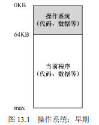
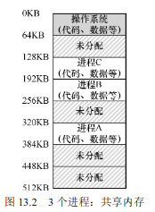
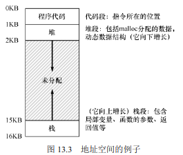

# 抽象：地址空间

## 早期系统

从内存来看，早期的机器并没有提供多少抽象给用户。基本上，机器的物理内存看起来如图13.1 所示。

## 多道程序与时分共享

过了一段时间，由于机器昂贵，人们开始更有效地共享机器。因此，多道程序（multiprogramming）系统时代开启[DV66]

但很快，人们开始对机器要求更多，分时系统的时代诞生了[S59，L60，M62，M83]。具体来说，许多人意识到批量计算的局限性，尤其是程序员本身[CV65]，他们厌倦了长时间的（因此也是低效率的）编程—调试循环。交互性（interactivity）变得很重要，

一种实现时分共享的方法，是让一个进程单独占用全部内存运行一小段时间（见图13.1），然后停止它，并将它所有的状态信息保存在磁盘上（包含所有的物理内存），加载其他进程的状态信息，再运行一段时间，这就实现了某种比较粗糙的机器共享[M+63]。 

遗憾的是，这种方法有一个问题：太慢了，特别是当内存增长的时候。虽然保存和恢复寄存器级的状态信息（程序计数器、通用寄存器等）相对较快，但将全部的内存信息保存到磁盘就太慢了。因此，在进程切换的时候，我们仍然将进程信息放在内存中，这样操作系统可以更有效率地实现时分共享（见图13.2）

随着时分共享变得更流行，人们对操作系统又有了新的要求。特别是多个程序同时驻留在内存中，使保护（protection）成为重要问题。人们不希望一个进程可以读取其他进程的内存，更别说修改了。

## 地址空间

## 目标

虚拟内存（VM）系统的一个主要目标是透明（transparency）①。操作系统实现虚拟内存的方式，应该让运行的程序看不见。

虚拟内存的另一个目标是效率（efficiency）。操作系统应该追求虚拟化尽可能高效
（efficient），包括时间上（即不会使程序运行得更慢）和空间上（即不需要太多额外的内存
来支持虚拟化）。在实现高效率虚拟化时，操作系统将不得不依靠硬件支持，包括TLB 这样的硬件功能（我们将在适当的时候学习）。

最后，虚拟内存第三个目标是保护（protection）。操作系统应确保进程受到保护（protect），不会受其他进程影响，操作系统本身也不会受进程影响。