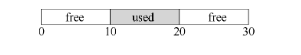
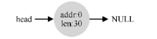
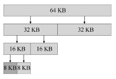

# 空闲空间管理

## 假设

## 底层机制

### 分割与合并

这个堆对应的空闲列表会有两个元素，一个描述第一个10 字节的空闲区域（字节0～9），
一个描述另一个空闲区域（字节20～29）：

假设我们只申请一个字节的内存。这种情况下，分配程序会执行所谓的分割（splitting）
动作：它找到一块可以满足请求的空闲空间，将其分割，第一块返回给用户，第二块留在空
闲列表中。

如果新归还的空间与一个原有空闲块相邻（或两个，就像这个例子），就将它们合并为一个较大的空闲块。通过合并，最后空闲列表应该像这样：

### 追踪已分配空间的大小 

要完成这个任务，大多数分配程序都会在头块（header）中保存一点额外的信息，它在
内存中，通常就在返回的内存块之前。

### 嵌入空闲列表

## 基本策略

### 最优匹配

### 最差匹配

### 首次匹配

### 下次匹配

## 其他方式

### 分离空闲列表

一直以来有一种很有趣的方式叫作分离空闲列表（segregated  list）。基本想法很简单：
如果某个应用程序经常申请一种（或几种）大小的内存空间，那就用一个独立的列表，只
管理这样大小的对象。其他大小的请求都一给更通用的内存分配程序。 

### 伙伴系统

在这种系统中，空闲空间首先从概念上被看成大小为 2N的大空间。当有一个内存分配
请求时，空闲空间被递归地一分为二，直到刚好可以满足请求的大小（再一分为二就无法
满足）。这时，请求的块被返回给用户。在下面的例子中，一个64KB 大小的空闲空间被切
分，以便提供7KB 的块：