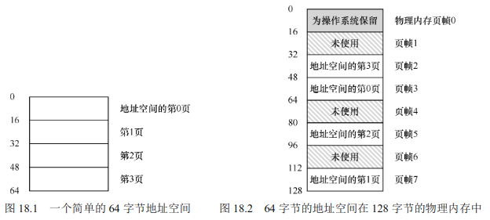

# 分页

作系统有两种方法，来解决大多数空间管理问题。第一种是将空
间分割成不同长度的分片，就像虚拟内存管理中的分段。遗憾的是，这个解决方法存在固
有的问题。具体来说，将空间切成不同长度的分片以后，空间本身会碎片化（fragmented），
随着时间推移，分配内存会变得比较困难。 
因此，值得考虑第二种方法：将空间分割成固定长度的分片。在虚拟内存中，我们称
这种思想为分页，可以追溯到一个早期的重要系统，Atlas[KE+62, L78]。分页不是将一个进
程的地址空间分割成几个不同长度的逻辑段（即代码、堆、段），而是分割成固定大小的单
元，每个单元称为一页。相应地，我们把物理内存看成是定长槽块的阵列，叫作页帧（page 
frame）。每个这样的页帧包含一个虚拟内存页。

分页有许多优点。可能最大的改进就是灵活性：
通过完善的分页方法，操作系统能够高效地提供地址空间的抽象，不管进程如何使用地址
空间。例如，我们不会假定堆和栈的增长方向，以及它们如何使用。

另一个优点是分页提供的空闲空间管理的简单性。例如，如果操作系统希望将64 字节
的小地址空间放到 8  页的物理地址空间中，它只要找到 4 个空闲页。

为了记录地址空间的每个虚拟页放在物理内存中的位置，操作系统通常为每个进程保
存一个数据结构，称为页表（page table）。页表的主要作用是为地址空间的每个虚拟页面保
存地址转换（address translation），从而让我们知道每个页在物理内存中的位置。

重要的是要记住，这个页表是一个每进程的数据结构（我们讨论的大多数页表结构都
是每进程的数据结构，我们将接触的一个例外是倒排页表，inverted  page  table）。如果在上
面的示例中运行另一个进程，操作系统将不得不为它管理不同的页表，因为它的虚拟页显
然映射到不同的物理页面（除了共享之外）。

为了转换（translate）该过程生成的虚拟地址，我们必须首先将它分成两个组件：虚拟
页面号（virtual page number，VPN）和页内的偏移量（offset）

## 