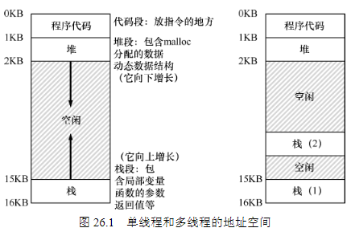

本章将介绍为单个运行进程提供的新抽象：线程（thread）。经典观点是一个程序只有
一个执行点（一个程序计数器，用来存放要执行的指令），但多线程（multi-threaded）程序会有多个执行点（多个程序计数器，每个都用于取指令和执行）。换一个角度来看，每个线程类似于独立的进程，只有一点区别：它们共享地址空间，从而能够访问相同的数据。

现在，我们需要一个或多个线程控制块（Thread  Control  Block，TCB），保存每个线程的状态。但是，与进程相比，线程之间的上下文切换有一点主要区别：地址空间保持不变（即不需要切换当前使用的页表）。

然而，在多线程的进程中，每个线程独立运行，当然可以调用各种例程来完成正在执
行的任何工作。不是地址空间中只有一个栈，而是每个线程都有一个栈。假设有一个多线程的进程，它有两个线程，结果地址空间看起来不同（见图26.1 右图）。

你可能注意到，多个栈也破坏了地址空间布局的美感。以前，堆和栈可以互不影响地
增长，直到空间耗尽。多个栈就没有这么简单了。幸运的是，通常栈不会很大（除了大量
使用递归的程序）

## 为什么更糟糕：共享数据

## 核心问题：不可控的调度
这里展示的情况称为竞态条件（race  condition）：结果取决于代码的时间执行。由于运气不好（即在执行过程中发生的上下文切换），我们得到了错误的结果。事实上，可能每次都会得到不同的结果。因此，我们称这个结果是不确定的（indeterminate），而不是确定的（deterministic）计算（我们习惯于从计算机中得到）。不确定的计算不知道输出是什么，它在不同运行中确实可能是不同的。 

由于执行这段代码的多个线程可能导致竞争状态，因此我们将此段代码称为临界区
（critical section）。临界区是访问共享变量（或更一般地说，共享资源）的代码片段，一定不能由多个线程同时执行。 

我们真正想要的代码就是所谓的互斥（mutual  exclusion）。这个属性保证了如果一个线程在临界区内执行，其他线程将被阻止进入临界区。

## 原子性愿望

在这里，原子方式的意思是“作为一个单元”，有时我们说“全部或没有”。

## 还有一个问题：等待另一个线程