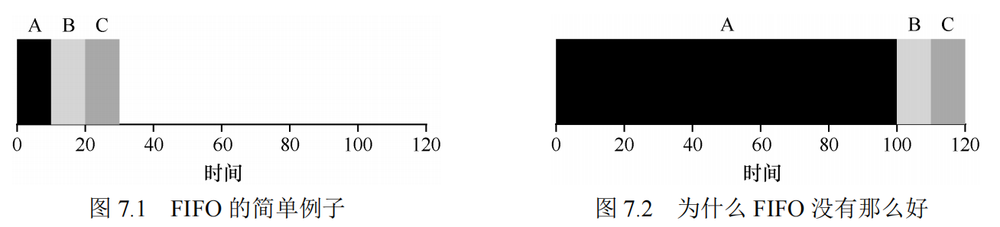
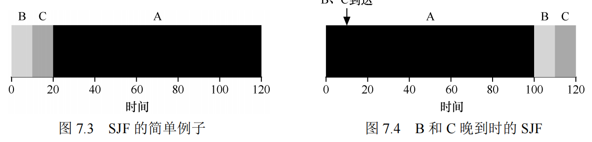
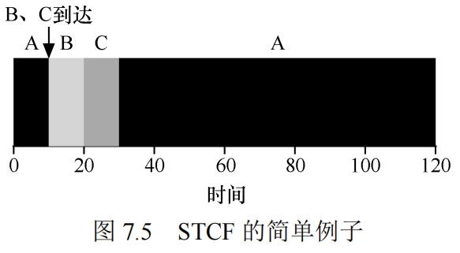
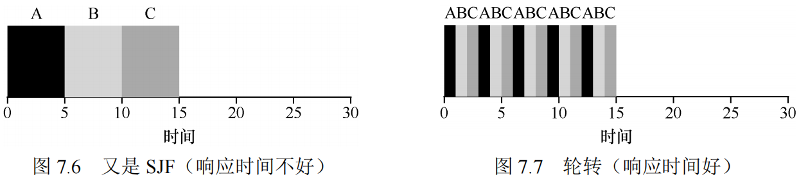
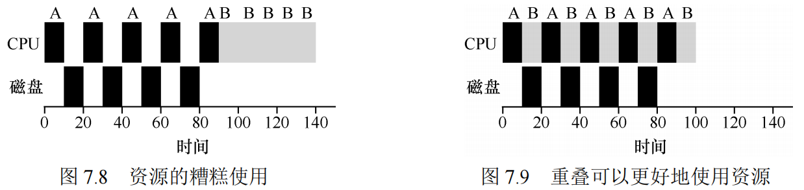

# 进程调度介绍

## 工作负载假设

这些假设与系统中运行的进程有关，有时候统称为工作负载（workload）。确定工作负载是构建调度策略的关键部分。工作负载了解得越多，你的策略就越优化。

我们对操作系统中运行的进程（有时也叫工作任务）做出如下的假设：
1．每一个工作运行相同的时间。
2．所有的工作同时到达。
3．一旦开始，每个工作保持运行直到完成。
4．所有的工作只是用 CPU（即它们不执行 IO 操作）。
5．每个工作的运行时间是已知的。

## 调度指标

现在，让我们简化一下生活，只用一个指标：周转时间（turnaround time）。任务的周转时间定义为任务完成时间减去任务到达系统的时间。更正式的周转时间定义 T 周转时间是：T 周转时间= T 完成时间−T 到达时间

你应该注意到，周转时间是一个性能（performance）指标，这将是本章的首要关注点。另一个有趣的指标是公平（fairness），比如 Jian's Fairness Index[J91]。性能和公平在调度系统中往往是矛盾的。

### 先进先出（FIFO）

这个问题通常被称为护航效应（convoy effect）[B+79]，一些耗时较少的潜在资源消费者被排在重量级的资源消费者之后。

### 最短任务优先

从图中可以看出，即使 B 和 C 在 A 之后不久到达，它们仍然被迫等到 A 完成，从而遭遇同样的护航问题

### 最短完成时间优先（STCF）

幸运的是，有一个调度程序完全就是这样做的：向 SJF 添加抢占，称为最短完成时间优先（Shortest Time-to-Completion First，STCF）或抢占式最短作业优先（Preemptive Shortest Job First ，PSJF）调度程序[CK68]。每当新工作进入系统时，它就会确定剩余工作和新工作中，谁的剩余时间最少，然后调度该工作。

平均周转时间大大提高

## 新度量指标：响应时间

然而，引入分时系统改变了这一切。现在，用户将会坐在终端前面，同时也要求系统的交互性好。因此，一个新的度量标准诞生了：响应时间（response time）。

响应时间定义为从任务到达系统到首次运行的时间。更正式的定义是：T 响应时间= T 首次运行−T 到达时间

### 轮转

为了解决这个问题，我们将介绍一种新的调度算法，通常被称为轮转（Round-Robin，RR）调度[K64]。基本思想很简单：RR 在一个时间片（time slice，有时称为调度量子，scheduling quantum）内运行一个工作，然后切换到运行队列中的下一个任务，而不是运行一个任务直到结束。它反复执行，直到所有任务完成。因此，RR 有时被称为时间切片（time-slicing）。请注意，时间片长度必须是时钟中断周期的倍数。因此，如果时钟中断是每 10ms 中断一次，则时间片可以是 10ms、20ms 或 10ms 的任何其他倍数。

如你所见，时间片长度对于 RR 是至关重要的。越短，RR 在响应时间上表现越好。然而，时间片太短是有问题的：突然上下文切换的成本将影响整体性能。因此，系统设计者需要权衡时间片的长度，使其足够长，以便摊销（amortize）上下文切换成本，而又不会使系统不及时响应。

### 结合IO
调度程序显然要在工作发起 I/O 请求时做出决定，因为当前正在运行的作业在 I/O 期间不会使用 CPU，它被阻塞等待 I/O 完成。如果将 I/O 发送到硬盘驱动器，则进程可能会被阻塞几毫秒或更长时间，具体取决于驱动器当前的 I/O 负载。因此，这时调度程序应该在 CPU上安排另一项工作。

调度程序还必须在 I/O 完成时做出决定。发生这种情况时，会产生中断，操作系统运行并将发出 I/O 的进程从阻塞状态移回就绪状态。

这样我们就看到了调度程序可能如何结合 I/O。通过将每个 CPU 突发作为一项工作，调度程序确保“交互”的进程经常运行。当这些交互式作业正在执行 I/O 时，其他 CPU 密集型作业将运行，从而更好地利用处理器。

### 无法预知

