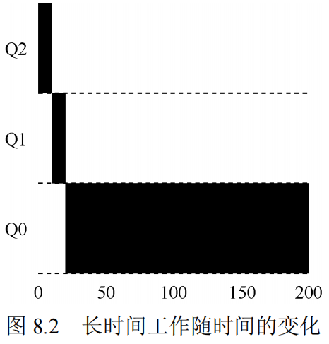
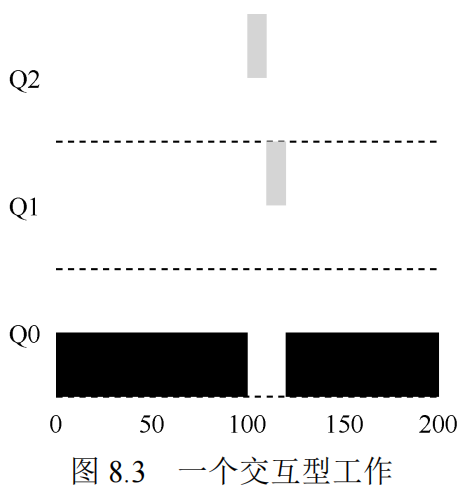
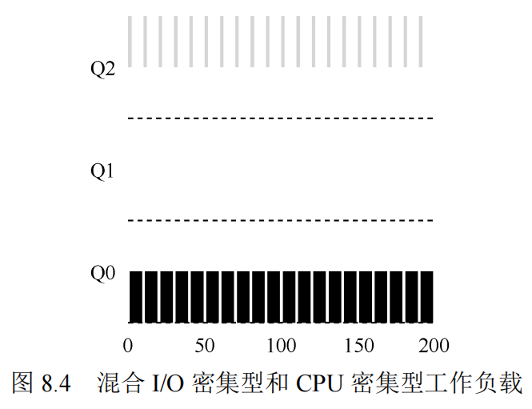
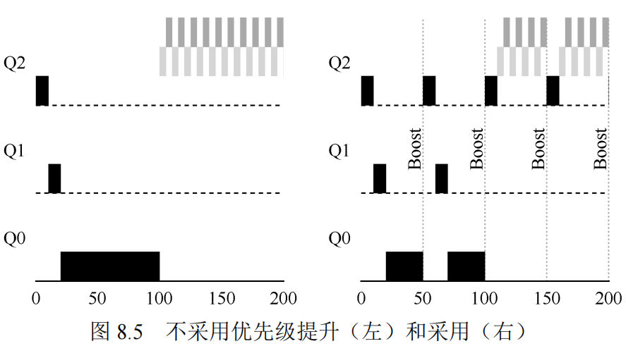
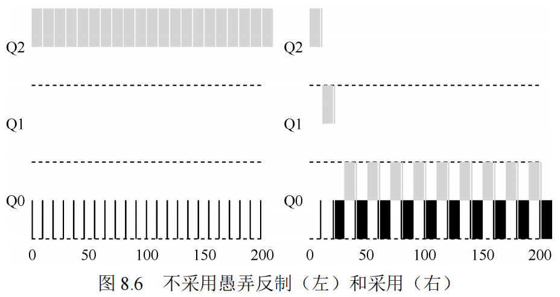

#调度：多级反馈队列

多级反馈队列需要解决两方面的问题。首先，它要优化周转时间。在第 7 章中我们看到，这通过先执行短工作来实现。然而，操作系统通常不知道工作要运行多久，而这又是SJF（或 STCF）等算法所必需的。其次，MLFQ 希望给交互用户（如用户坐在屏幕前，等着进程结束）很好的交互体验，因此需要降低响应时间。然而，像轮转这样的算法虽然降低了响应时间，周转时间却很差。

所以这里的问题是：通常我们对进程一无所知，应该如何构建调度程序来实现这些目标？调度程序如何在运行过程中学习进程的特征，从而做出更好的调度决策？

>关键问题：没有完备知识如何调度？

>从历史中学习：多级反馈队列是用历史经验预测未来的一个典型的例子，操作系统中有很多地方采用了这种技术（同样存在于计算机科学领域的很多其他地方，比如硬件的分支预测及缓存算法）。如果工作有明显的阶段性行为，因此可以预测，那么这种方式会很有效。当然，必须十分小心地使用这种技术，因为它可能
出错，让系统做出比一无所知的时候更糟的决定。

## MLFQ：基本规则

MLFQ 中有许多独立的队列（queue），每个队列有不同的优先级（priority level）。任何时刻，一个工作只能存在于一个队列中。MLFQ 总是优先执行较高优先级的工作（即在较高级队列中的工作）。

当然，每个队列中可能会有多个工作，因此具有同样的优先级。在这种情况下，我们就对这些工作采用轮转调度。

因此，MLFQ 调度策略的关键在于如何设置优先级。MLFQ 没有为每个工作指定不变的优先级，而是根据观察到的行为调整它的优先级。例如，如果一个工作不断放弃CPU 去等待键盘输入，这是交互型进程的可能行为，MLFQ 因此会让它保持高优先级。相反，如果一个工作长时间地占用 CPU，MLFQ 会降低其优先级。通过这种方式，MLFQ 在进程运行过程中学习其行为，从而利用工作的历史来预测它未来的行为。

至此，我们得到了 MLFQ 的两条基本规则。
* 规则 1：如果 A 的优先级 > B 的优先级，运行 A（不运行 B）。
* 规则 2：如果 A 的优先级 = B 的优先级，轮转运行A 和 B。

## 尝试1：如何改变优先级

* 规则 3：工作进入系统时，放在最高优先级（最上层队列）。
 
* 规则 4a：工作用完整个时间片后，降低其优先级（移入下一个队列）。
 
* 规则 4b：如果工作在其时间片以内主动释放 CPU，
则优先级不变。

实例 1：单个长工作

实例 2：来了一个短工作

算法的主要目标：如果不知道工作是短工作还是长工作，那么就在开始的时候假设其是短工作，并赋予最高优先级。如果确实是短工作，则很快会执行完毕，否则将被慢慢移入低优先级队列，而这时该工作也被认为是长工作了。

实例3：如果有IO

交互型工作 B（用灰色表示）每执行 1ms 便需要进行 I/O操作，它与长时间运行的工作 A（用黑色表示）竞争 CPU。MLFQ 算法保持 B 在最高优先级，因为 B 总是让出 CPU。如果 B 是交互型工作，MLFQ 就进一步实现了它的目标，让交互型工作快速运行。

## MLFQ的问题

首先，会有饥饿（starvation）问题。如果系统有“太多”交互型工作，就会不断占用CPU，导致长工作永远无法得到 CPU（它们饿死了）。即使在这种情况下，我们希望这些长工作也能有所进展。

其次，聪明的用户会重写程序，愚弄调度程序（game the scheduler）。愚弄调度程序指的是用一些卑鄙的手段欺骗调度程序，让它给你远超公平的资源。上述算法对如下的攻击束手无策：进程在时间片用完之前，调用一个 I/O 操作（比如访问一个无关的文件），从而主动释放 CPU。如此便可以保持在高优先级，占用更多的 CPU 时间。做得好时（比如，每运行 99%的时间片时间就主动放弃一次 CPU），工作可以几乎独占 CPU。

最后，一个程序可能在不同时间表现不同。一个计算密集的进程可能在某段时间表现为一个交互型的进程。用我们目前的方法，它不会享受系统中其他交互型工作的待遇。

## 尝试2：提升优先级

让我们试着改变之前的规则，看能否避免饥饿问题。要让 CPU 密集型工作也能取得一些进展（即使不多），我们能做些什么？

一个简单的思路是周期性地提升（boost）所有工作的优先级。可以有很多方法做到，但我们就用最简单的：将所有工作扔到最高优先级队列。于是有了如下的新规则。

* 规则 5：经过一段时间 S，就将系统中所有工作重新加入最高优先级队列。

新规则一下解决了两个问题。首先，进程不会饿死——在最高优先级队列中，它会以轮转的方式，与其他高优先级工作分享 CPU，从而最终获得执行。其次，如果一个 CPU 密集型工作变成了交互型，当它优先级提升时，调度程序会正确对待它。

当然，添加时间段 S 导致了明显的问题：S 的值应该如何设置？

## 尝试3：更好的计时方式

现在还有一个问题要解决：如何阻止调度程序被愚弄？可以看出，这里的元凶是规则4a 和 4b，导致工作在时间片以内释放 CPU，就保留它的优先级。那么应该怎么做？

这里的解决方案，是为 MLFQ 的每层队列提供更完善的 CPU 计时方式（accounting）。调度程序应该记录一个进程在某一层中消耗的总时间，而不是在调度时重新计时。只要进程用完了自己的配额，就将它降到低一优先级的队列中去。不论它是一次用完的，还是拆成很多次用完。因此，我们重写规则 4a 和 4b。

* 规则 4：一旦工作用完了其在某一层中的时间配额（无论中间主动放弃了多少次CPU），就降低其优先级（移入低一级队列）。

## MLFQ调优及其他问题

