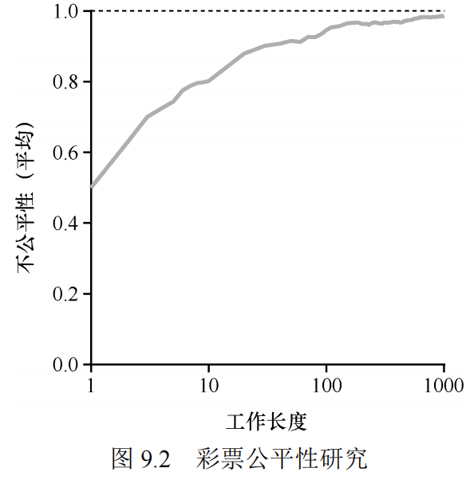
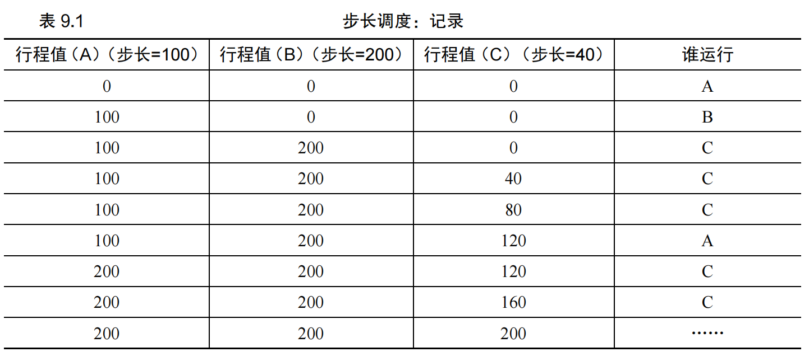

# 调度：比例份额

比例份额算法基于一个简单的想法：调度程序的最终目标，是确保每个工作获得一定比例的 CPU 时间，而不是优化周转时间和响应时间。

## 基本概念：彩票数表示份额

彩票调度背后是一个非常基本的概念：彩票数（ticket）代表了进程（或用户或其他）占有某个资源的份额。一个进程拥有的彩票数占总彩票数的百分比，就是它占有资源的份额。

下面来看一个例子。假设有两个进程 A 和 B，A 拥有 75 张彩票，B 拥有 25 张。因此我们希望 A 占用 75%的 CPU 时间，而 B 占用 25%。通过不断定时地（比如，每个时间片）抽取彩票，彩票调度从概率上（但不是确定的）获得这种份额比例。抽取彩票的过程很简单：调度程序知道总共的彩票数（在我们的例子
中，有 100 张）。调度程序抽取中奖彩票，这是从 0 和 99①之间的一个数，拥有这个数对应的彩票的进程中奖。假设进程 A 拥有 0 到 74 共 75 张彩票，进程 B 拥有 75 到 99 的 25 张，中奖的彩票就决定了运行 A 或 B。调度程序然后加载中奖进程的状态，并运行它。

>利用随机性
>彩票调度最精彩的地方在于利用了随机性（randomness）。当你需要做出决定时，采用随机的方式
常常是既可靠又简单的选择。随机方法相对于传统的决策方式，至少有 3 点优势。**第一，随机方法常常可以避免奇怪的边角情况，较传统的算法可能在处理这些情况时遇到麻烦。第二，随机方法很轻量，几乎不需要记录任何状态。第三，随机方法很快。只要能很快地产生随机数，做出决策就很快。**

## 彩票机制

彩票调度还提供了一些机制，以不同且有效的方式来调度彩票。一种方式是利用彩票货币（ticket currency）的概念。这种方式允许拥有一组彩票的用户以他们喜欢的某种货币，将彩票分给自己的不同工作。之后操作系统再自动将这种货币兑换为正确的全局彩票。

另一个有用的机制是彩票转让（ticket transfer）。通过转让，一个进程可以临时将自己的彩票交给另一个进程。这种机制在客户端/服务端交互的场景中尤其有用，在这种场景中，客户端进程向服务端发送消息，请求其按自己的需求执行工作，为了加速服务端的执行，客户端可以将自己的彩票转让给服务端，从而尽可能加速服务端执行自己请求的速度。服务端执行结束后会将这部分彩票归还给客户端。

最后，彩票通胀（ticket inflation）有时也很有用。利用通胀，一个进程可以临时提升或降低自己拥有的彩票数量。当然在竞争环境中，进程之间互相不信任，这种机制就没什么意义。一个贪婪的进程可能给自己非常多的彩票，从而接管机器。但是，通胀可以用于进程之间相互信任的环境。在这种情况下，如果一个进程知道它需要更多 CPU 时间，就可以增加自己的彩票，从而将自己的需求告知操作系统，这一切不需要与任何其他进程通信。

## 实现

## 例子
为了更好地理解彩票调度的运行过程，我们现在简单研究一下两个互相竞争工作的完成时间，每个工作都有相同数目的 100 张彩票，以及相同的运行时间 R（稍后会改变）。

这种情况下，我们希望两个工作在大约同时完成，但由于彩票调度算法的随机性，有时一个工作会先于另一个完成。

为了量化这种区别，我们定义了一个简单的不公平指标 U（unfairness metric），将两个工作完成时刻相除得到 U 的值。比如，运行时间 R 为 10，第一个工作在时刻 10 完成，另一个在20，U=10/20=0.5。如果两个工作几乎同时完成，U的值将很接近于 1。在这种情况下，我们的目标是：完美的公平调度程序可以做到 U=1。

9.2 展示了当两个工作的运行时间从 1 到1000 变化时，30 次试验的平均 U 值（利用本章末尾的模拟器产生的结果）。可以看出，当工作执行时间很短时，平均不公平度非常糟糕。只有当工作执行非常多的时间片时，彩票调度算法才能得到期望的结果。



## 如何分配彩票

假设用户自己知道如何分配，因此可以给每个用户一定量的彩票，由用户按照需要自主分配给自己的工作。然而这种方案似乎什么也没有解决——还是没有给出具体的分配策略。因此对于给定的一组工作，彩票分配的问题依然没有最佳答案。

## 为什么不是确定的

你可能还想知道，究竟为什么要利用随机性？从上面的内容可以看出，虽然随机方式可以使得调度程序的实现简单（且大致正确），但偶尔并不能产生正确的比例，尤其在工作运行时间很短的情况下。由于这个原因，Waldspurger 提出了步长调度（stride scheduling），一个确定性的公平分配算法[W95]。

步长调度也很简单。系统中的每个工作都有自己的步长，这个值与票数值成反比。在上面的例子中，A、B、C 这 3 个工作的票数分别是 100、50 和 250，我们通过用一个大数分别除以他们的票数来获得每个进程的步长。比如用 10000 除以这些票数值，得到了 3 个进程的步长分别为 100、200 和 40。我们称这个值为每个进程的步长（stride）。每次进程运行后，我们会让它的计数器 [称为行程（pass）值] 增加它的步长，记录它的总体进展。之后，调度程序使用进程的步长及行程值来确定调度哪个进程。基本思路很简单：当需要进行调度时，选择目前拥有最小行程值的进程，并且在运行之后将该进程的行程值增加一个步长。
下面是 Waldspurger[W95]给出的伪代码：

```
current = remove_min(queue); // pick client with minimum pass 
schedule(current); // use resource for quantum 
current->pass += current->stride; // compute next pass using stride 
insert(queue, current); // put back into the queue
```



可以看出，C 运行了 5 次、A 运行了 2 次，B 一次，正好是票数的比例——200、100 和 50。彩票调度算法只能一段时间后，在概率上实现比例，而步长调度算法可以在每个调度周期后做到完全正确。

你可能想知道，既然有了可以精确控制的步长调度算法，为什么还要彩票调度算法呢？好吧，彩票调度有一个步长调度没有的优势——不需要全局状态。假如一个新的进程在上面的步长调度执行过程中加入系统，应该怎么设置它的行程值呢？设置成 0 吗？这样的话，它就独占 CPU 了。而彩票调度算法不需要对每个进程记录全局状态，只需要用新进程的票数更新全局的总票数就可以了。因此彩票调度算法能够更合理地处理新加
入的进程。

## 小结

虽然两者都很有趣，但由于一些原因，并没有作为 CPU 调度程序被广泛使用。一个原因是这两种方式都不能很好地适合 I/O[AC97]；另一个原因是其中最难的票数分配问题并没有确定的解决方式。

结果，比例份额调度程序只有在这些问题可以相对容易解决的领域更有用（例如容易确定份额比例）。例如在虚拟（virtualized）数据中心中，你可能会希望分配 1/4 的 CPU 周期给 Windows 虚拟机，剩余的给 Linux 系统，比例分配的方式可以更简单高效。